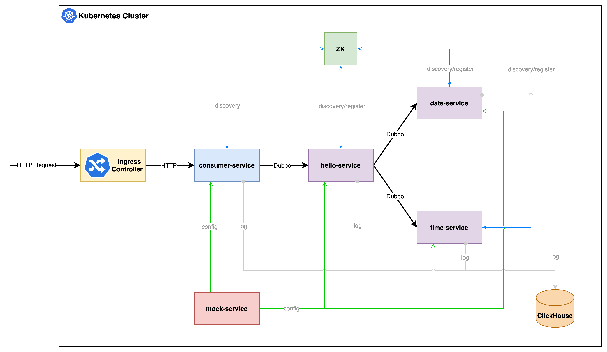

# Architecture

## Summary




## Details


## 环境搭建

搭建 Kubernetes 环境，可以选择 kubeadm 进行集群搭建。也可以选择 minikube、k3s、Kind 等，本文使用 k3s。

使用 [k3d](https://k3d.io/) 安装 [k3s](https://github.com/k3s-io/k3s)。k3d 将在 Docker 容器中运行 k3s，因此需要保证已经安装了 Docker。

```shell
$ k3d cluster create dubbo-demo -p "80:80@loadbalancer" --k3s-server-arg '--no-deploy=traefik'
```

## 安装 Flomesh

从仓库 `https://github.com/flomesh-io/service-mesh-dubbo-demo` 克隆代码。进入到 `release`目录。

所有 Flomesh 组件以及用于 demo 的 yamls 文件都位于这个目录中。

```shell
$ kubectl apply -f artifacts/cert-manager-v1.3.1.yaml
customresourcedefinition.apiextensions.k8s.io/certificaterequests.cert-manager.io created
customresourcedefinition.apiextensions.k8s.io/certificates.cert-manager.io created
customresourcedefinition.apiextensions.k8s.io/challenges.acme.cert-manager.io created
customresourcedefinition.apiextensions.k8s.io/clusterissuers.cert-manager.io created
customresourcedefinition.apiextensions.k8s.io/issuers.cert-manager.io created
customresourcedefinition.apiextensions.k8s.io/orders.acme.cert-manager.io created
namespace/cert-manager created
serviceaccount/cert-manager-cainjector created
serviceaccount/cert-manager created
serviceaccount/cert-manager-webhook created
clusterrole.rbac.authorization.k8s.io/cert-manager-cainjector created
clusterrole.rbac.authorization.k8s.io/cert-manager-controller-issuers created
clusterrole.rbac.authorization.k8s.io/cert-manager-controller-clusterissuers created
clusterrole.rbac.authorization.k8s.io/cert-manager-controller-certificates created
clusterrole.rbac.authorization.k8s.io/cert-manager-controller-orders created
clusterrole.rbac.authorization.k8s.io/cert-manager-controller-challenges created
clusterrole.rbac.authorization.k8s.io/cert-manager-controller-ingress-shim created
clusterrole.rbac.authorization.k8s.io/cert-manager-view created
clusterrole.rbac.authorization.k8s.io/cert-manager-edit created
clusterrole.rbac.authorization.k8s.io/cert-manager-controller-approve:cert-manager-io created
clusterrole.rbac.authorization.k8s.io/cert-manager-webhook:subjectaccessreviews created
clusterrolebinding.rbac.authorization.k8s.io/cert-manager-cainjector created
clusterrolebinding.rbac.authorization.k8s.io/cert-manager-controller-issuers created
clusterrolebinding.rbac.authorization.k8s.io/cert-manager-controller-clusterissuers created
clusterrolebinding.rbac.authorization.k8s.io/cert-manager-controller-certificates created
clusterrolebinding.rbac.authorization.k8s.io/cert-manager-controller-orders created
clusterrolebinding.rbac.authorization.k8s.io/cert-manager-controller-challenges created
clusterrolebinding.rbac.authorization.k8s.io/cert-manager-controller-ingress-shim created
clusterrolebinding.rbac.authorization.k8s.io/cert-manager-controller-approve:cert-manager-io created
clusterrolebinding.rbac.authorization.k8s.io/cert-manager-webhook:subjectaccessreviews created
role.rbac.authorization.k8s.io/cert-manager-cainjector:leaderelection created
role.rbac.authorization.k8s.io/cert-manager:leaderelection created
role.rbac.authorization.k8s.io/cert-manager-webhook:dynamic-serving created
rolebinding.rbac.authorization.k8s.io/cert-manager-cainjector:leaderelection created
rolebinding.rbac.authorization.k8s.io/cert-manager:leaderelection created
rolebinding.rbac.authorization.k8s.io/cert-manager-webhook:dynamic-serving created
service/cert-manager created
service/cert-manager-webhook created
deployment.apps/cert-manager-cainjector created
deployment.apps/cert-manager created
deployment.apps/cert-manager-webhook created
mutatingwebhookconfiguration.admissionregistration.k8s.io/cert-manager-webhook created
validatingwebhookconfiguration.admissionregistration.k8s.io/cert-manager-webhook created
```

注意: 要保证 `cert-manager` 命名空间中所有的 pod 都正常运行：

```shell
$ kubectl get pod -n cert-manager
NAME                                       READY   STATUS    RESTARTS   AGE
cert-manager-cainjector-59f76f7fff-ggmdm   1/1     Running   0          32s
cert-manager-59f6c76f4b-r2h5r              1/1     Running   0          32s
cert-manager-webhook-56fdcbb848-sdnxb      1/1     Running   0          32s
```

### 安装 Pipy Operator

```shell
$ kubectl apply -f artifacts/pipy-operator.yaml
```

执行完命令后会看到类似的结果：

```
namespace/flomesh created
customresourcedefinition.apiextensions.k8s.io/proxies.flomesh.io created
customresourcedefinition.apiextensions.k8s.io/proxyprofiles.flomesh.io created
serviceaccount/operator-manager created
role.rbac.authorization.k8s.io/leader-election-role created
clusterrole.rbac.authorization.k8s.io/manager-role created
clusterrole.rbac.authorization.k8s.io/metrics-reader created
clusterrole.rbac.authorization.k8s.io/proxy-role created
rolebinding.rbac.authorization.k8s.io/leader-election-rolebinding created
clusterrolebinding.rbac.authorization.k8s.io/manager-rolebinding created
clusterrolebinding.rbac.authorization.k8s.io/proxy-rolebinding created
configmap/manager-config created
service/operator-manager-metrics-service created
service/proxy-injector-svc created
service/webhook-service created
deployment.apps/operator-manager created
deployment.apps/proxy-injector created
certificate.cert-manager.io/serving-cert created
issuer.cert-manager.io/selfsigned-issuer created
mutatingwebhookconfiguration.admissionregistration.k8s.io/mutating-webhook-configuration created
mutatingwebhookconfiguration.admissionregistration.k8s.io/proxy-injector-webhook-cfg created
validatingwebhookconfiguration.admissionregistration.k8s.io/validating-webhook-configuration created
```

注意：要保证 `flomesh` 命名空间中所有的 pod 都正常运行：

```shell
$ kubectl get pod -n flomesh
NAME                              READY   STATUS    RESTARTS   AGE
proxy-injector-6d5c774bc-rspmc    1/1     Running   0          21s
operator-manager-c95cd449-xxc77   0/1     Running   0          38s
```

### 安装 Ingress 控制器：ingress-pipy

```shell
$ kubectl apply -f artifacts/ingress-pipy.yaml
namespace/ingress-pipy created
customresourcedefinition.apiextensions.k8s.io/ingressglobalhooks.flomesh.io created
customresourcedefinition.apiextensions.k8s.io/ingressrules.flomesh.io created
serviceaccount/ingress-pipy created
role.rbac.authorization.k8s.io/ingress-pipy-leader-election-role created
clusterrole.rbac.authorization.k8s.io/ingress-pipy-role created
rolebinding.rbac.authorization.k8s.io/ingress-pipy-leader-election-rolebinding created
clusterrolebinding.rbac.authorization.k8s.io/ingress-pipy-rolebinding created
configmap/ingress-config created
service/ingress-pipy-cfg created
service/ingress-pipy-controller created
service/ingress-pipy-defaultbackend created
service/webhook-service created
deployment.apps/ingress-pipy-cfg created
deployment.apps/ingress-pipy-controller created
deployment.apps/ingress-pipy-manager created
certificate.cert-manager.io/serving-cert created
issuer.cert-manager.io/selfsigned-issuer created
mutatingwebhookconfiguration.admissionregistration.k8s.io/mutating-webhook-configuration configured
validatingwebhookconfiguration.admissionregistration.k8s.io/validating-webhook-configuration configured
```

检查 `ingress-pipy` 命名空间下 pod 的状态：

```shell
$ kubectl get pod -n ingress-pipy
NAME                                      READY   STATUS    RESTARTS   AGE
svclb-ingress-pipy-controller-qwbk9       1/1     Running   0          90s
ingress-pipy-cfg-6c54d5b9b6-6s7lz         1/1     Running   0          90s
ingress-pipy-manager-7988dfbf4f-lxr4b     1/1     Running   0          90s
ingress-pipy-controller-9d4698887-zrpfd   1/1     Running   0          90s
```

至此，你已经成功安装 Flomesh 的所有组件，包括 operator 和 ingress 控制器。

## 运行 Demo

### 创建命名空间

Demo 运行在另一个独立的命名空间 `flomesh-dubbo` 中，执行命令 `kubectl apply -f dubbo-mesh/templates/namespace.yaml` 来创建该命名空间。如果你 `describe` 该命名空间你会发现其使用了 `flomesh.io/inject=true` 标签。

这个标签告知 operator 的 admission webHook 拦截标注的命名空间下 pod 的创建。

```shell
$ kubectl describe ns flomesh-dubbo
Name:         flomesh-dubbo
Labels:       app.kubernetes.io/managed-by=Helm
              app.kubernetes.io/name=dubbo-mesh
              app.kubernetes.io/version=1.19.0
              flomesh.io/inject=true
              helm.sh/chart=dubbo-mesh-0.1.0
              kubernetes.io/metadata.name=flomesh-dubbo
Annotations:  <none>
Status:       Active

No resource quota.

No LimitRange resource.
```

### 创建 ProxyProfile 资源

```
$ kubectl apply -f artifacts/proxy-profile.yaml
proxyprofile.flomesh.io/poc-pf-dubbo created
proxyprofile.flomesh.io/poc-pf-http created
```

### 创建 mock 服务

```shell
$ kubectl apply -f dubbo-mesh/templates/configmap-mock.yaml
$ kubectl apply -f dubbo-mesh/templates/configmap-proxychains.yaml

$ kubectl apply -f dubbo-mesh/templates/deployment-mock.yaml
$ kubectl apply -f dubbo-mesh/templates/service-mock.yaml
```

### 部署服务

``` shell
$ kubectl apply -f artifacts/deployment.yaml
```

## 测试

### 准备

访问 demo 服务都要通过 ingress 控制器。因此需要先获取 LB 的 ip 地址。

```shell
//Obtain the controller IP
//Here, we append port. 
ingressAddr=`kubectl get svc ingress-pipy-controller -n ingress-pipy -o jsonpath='{.spec.clusterIP}'`:80
```

这里我们使用了是 k3d 创建的 k3s，命令中加入了 `-p 80:80@loadbalancer` 选项。我们可以使用 `127.0.0.1:80` 来访问 ingress 控制器。这里执行命令 `ingressAddr=127.0.0.1:80`。

Ingress 规则中，我们为每个规则指定了 `host`，因此每个请求中需要通过 HTTP 请求头 `Host` 提供对应的 `host`。

或者在 `/etc/hosts` 添加记录：

```shell
$ kubectl get ing ingress-canary-router -n flomesh-dubbo -o jsonpath="{range .spec.rules[*]}{.host}{'\n'}"
dubbo.demo.flomesh.cn

//添加记录到 /etc/hosts
127.0.0.1 dubbo.demo.flomesh.cn
```

### 灰度

v1、v2 服务只能访问对应版本的服务。

```shell
$ curl --location --request POST 'http://127.0.0.1:80/hello' \
--header 'Host: dubbo.demo.flomesh.cn' \
--header 'x-canary-version: v1' \
--header 'Content-Type: application/json' \
--data-raw '{"name":"Flomesh"}'

V1-[hello-service] : Hello, Flomesh, Today is (2021-08-17), Time is (04:06:56.823)

$ curl --location --request POST 'http://127.0.0.1:80/hello' \
--header 'Host: dubbo.demo.flomesh.cn' \
--header 'x-canary-version: v2' \
--header 'Content-Type: application/json' \
--data-raw '{"name":"Flomesh"}'

V2-[hello-service] : Hello, Flomesh, Today is (Tue, 2021-Aug-17), Time is (04:06:37 +0000)
```